# Bund-ZuwendungsGraph 🕸️
> **Künstliche Intelligenz für digitale Souveränität in Verwaltungsprozessen.**

[](https://www.python.org/downloads/)
[](https://www.docker.com/)
[](https://github.com/enving/foerderwissensgraph/pkgs/container/foerderwissensgraph)
[](https://opensource.org/licenses/MIT)

---

### ⚠️ Wichtiger Hinweis (Disclaimer)
**Dies ist KEIN offizielles Projekt der Bundesregierung oder eines Ministeriums.**  
Es handelt sich um ein **Hobby-Projekt** der [DigitalAlchemisten](https://digitalalchemisten.de), das im Rahmen einer Forschungsinitiative für transparente Verwaltungsprozesse entstanden ist. Bei Fragen oder für mehr Informationen kontaktiere uns gerne über GitHub oder unsere Website.

---

## 🌟 Die Vision
Der **Bund-ZuwendungsGraph** ist mehr als eine Suchmaschine; er ist eine **kognitive Landkarte** der deutschen Förderlandschaft. Durch die Umwandlung statischer PDF-Richtlinien in einen dynamischen Knowledge Graph ermöglichen wir es, komplexe rechtliche Verflechtungen mit beispielloser Geschwindigkeit und Genauigkeit zu navigieren.

### ⚓ Kernsäulen
1.  **Semantische Präzision**: Geht über Keywords hinaus, um die *Bedeutung* rechtlicher Bestimmungen zu verstehen.
2.  **Graph-Integrität**: Bildet jede `REFERENCES`- und `SUPERSEDES`-Beziehung explizit ab.
3.  **Lokale Souveränität**: Nutzt **Docling** für lokales Parsing – sensible Daten bleiben in deiner Infrastruktur.
4.  **Zero-Touch DevOps**: Vollautomatisierte Bereitstellung und Datensynchronisation.

---

## 🗺️ Funktionsweise: Der Graph-RAG Vorteil

Standard-RAG (Retrieval-Augmented Generation) ist oft "blind" für Beziehungen. Wenn eine Vorschrift durch eine neuere ersetzt wird, könnte Standard-RAG immer noch die alte vorschlagen, nur weil die Keywords passen.

**Bund-ZuwendungsGraph basiert auf dem [easy-Online Formularschrank](https://foerderportal.bund.de/easy/easy_index.php?auswahl=easy_formulare)** und nutzt **Graph-Guided Retrieval**:
1.  **Abrufen**: Findet relevante Textstellen mittels Hybrid-Suche (BM25 + Vektor).
2.  **Explorieren**: Traversiert den Graphen, um übergeordnete Gesetze, Geschwister-Regelungen und neuere Versionen zu finden.
3.  **Synthetisieren**: Führt das gesamte Kontext-Netzwerk in das LLM (Mistral/IONOS), um eine quellenverifizierte Antwort zu generieren.

```mermaid
graph LR
    User([Suchanfrage]) --> Search[Hybrid-Suche]
    Search --> Chunks[Text-Abschnitte]
    Chunks --> Graph{Wissensgraph}
    Graph --> Context[Verknüpfter Kontext]
    Context --> LLM[Mistral-Large / IONOS]
    LLM --> Answer[Verifizierte Antwort mit Quellen]
```



---

## 🛸 Schnellstart

### 🌐 Direkter Zugriff
- **Dashboard**: [foerderwissensgraph.digitalalchemisten.de](https://foerderwissensgraph.digitalalchemisten.de)
- **API-Docs**: [/api/docs](https://foerderwissensgraph.digitalalchemisten.de/api/docs)
- **Status**: [/api/health](https://foerderwissensgraph.digitalalchemisten.de/api/health)

### 🐳 Lokale Installation
Das gesamte System startet in unter 2 Minuten:

```bash
git clone https://github.com/enving/foerderwissensgraph.git
cd foerderwissensgraph
cp .env.example .env
# .env bearbeiten und IONOS_API_KEY einfügen
docker compose up -d --build
```

---

## 🛠️ Automatisierter Betrieb (CI/CD)

Dieses Repository ist auf minimalen Wartungsaufwand ausgelegt:
- **Push-to-Deploy**: Jeder Commit auf `main` baut ein neues Image und rollt es auf dem VPS aus.
- **Monatlicher Auto-Sync**: Ein Hintergrundsystem crawlt quartalsweise den Formularschrank, parst alle neuen Dokumente und aktualisiert den Graphen automatisch.

---

## 📈 Roadmap & Meilensteine
- [x] **v1.0**: Basis-Crawler & Vektorsuche.
- [x] **v2.0**: Graph-RAG Implementierung (NetworkX + Hybrid Search).
- [x] **v2.2**: Produktion-Deployment & Dashboard UI.
- [ ] **Coming Soon**: Integration wichtiger Bundesgesetze (BHO, VwVfG) und Rahmenrichtlinien.
- [ ] **v2.5**: Kollaboratives Annotations-System & Peer-Review.

## 👩‍💻 Für Entwickler
Wir nutzen ein strukturiertes Task-Tracking direkt im Repository. Entwickler können den aktuellen Fortschritt und geplante Features in der **[.opencode/tasks.json](.opencode/tasks.json)** einsehen. Dies dient der Transparenz und hilft dabei, die Roadmap des Projekts nachzuvollziehen.

---
*Entwickelt für eine transparentere und effizientere Verwaltung.*
